[](https://github.com/NapoII/Discord_Rust_Team_Bot)
[](https://github.com/NapoII/Discord_Rust_Team_Bot/archive/refs/heads/main.zip) [](https://github.com/NapoII/Discord_Rust_Team_Bot/blob/main/LICENSE) [](https://img.shields.io/github/issues/NapoII/Discord_Rust_Team_Bot?style=plastic) [](https://img.shields.io/github/issues-raw/NapoII/Discord_Rust_Team_Bot) [](https://github.com/NapoII/Discord_Rust_Team_Bot/stargazers) [](https://discord.gg/knTKtKVfnr)

The Discord Rust Team Bot is your ultimate companion for Rust teams! 🎉🎮 It's packed with all the essentials your Rust squad needs on Discord: from setting up voice channels to handy helper tools and keeping tabs on players and servers. So, kick back, relax, and let the bot handle the heavy lifting while you focus on dominating in-game! 😎🔥
## 📝 Table of Contents
+ [Demo / Working](#demo)
+ [Install](#usage)
+ [How it works](#Use)
+ [Buy me a coffee](#coffee)
+ [LICENSE](#LICENSE)
## 🎥 Demo / Working <a name = "demo"></a>

## Features
- **Auto Voice Channels**: Automatically set up voice channels for your Rust squad.
- **Player and Team Tracking**: Keep track of players and teams on your server.
- **Server Tracking**: Monitor specific Rust servers for updates and information.
- **Helpful Rust Tools**: Access useful tools tailored for Rust gameplay.
- **Simple Channel Structure**: Maintain a clean and straightforward channel structure.
- **Auto Activity Updates**: Automatically update player count from target servers.
- **And Much More**: Explore additional features and functionalities!
### Create Channel Structure <a name = "Structure"></a>
The bot automatically creates the required channels when it is first started so that you can get started straight away.


To keep the Discord Rust area as clear as possible, only as many voice channels as necessary are automatically created and deleted again.

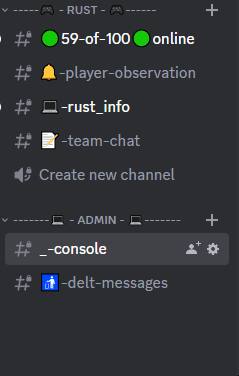

### Server Stats Channel

The server stats channel showcases essential details for the rust server. It presents information such as the number of players, current map, last wipe date, map seed, and size within an embed. Keep your community updated with vital server information at a glance!

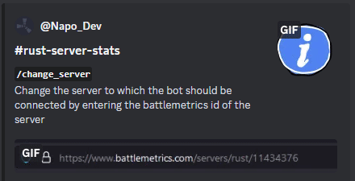

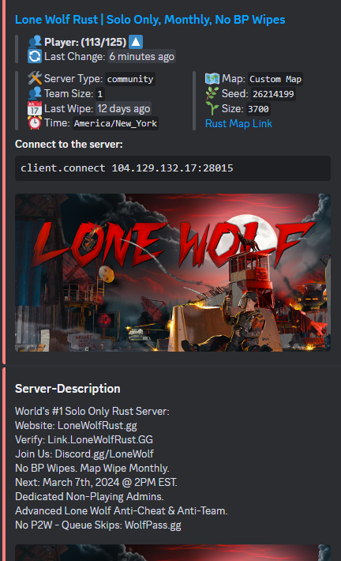

### Rust Collection

In the #rust-info channel, you can access various Rust-related commands for different functionalities. These commands cover topics such as CCTV codes, pager codes, prices, scrap yield calculations, quarry calculations, raid costs, extra binds, and electronic circuits. Use these commands to access the specific information or tools you need for your Rust gameplay.

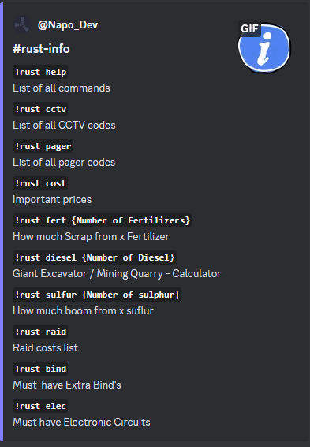
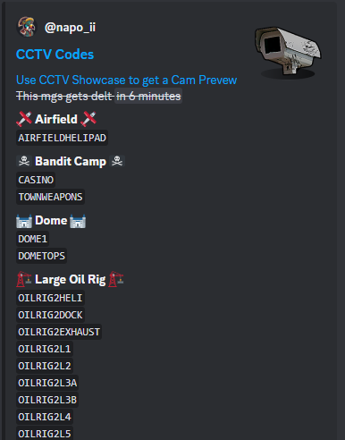
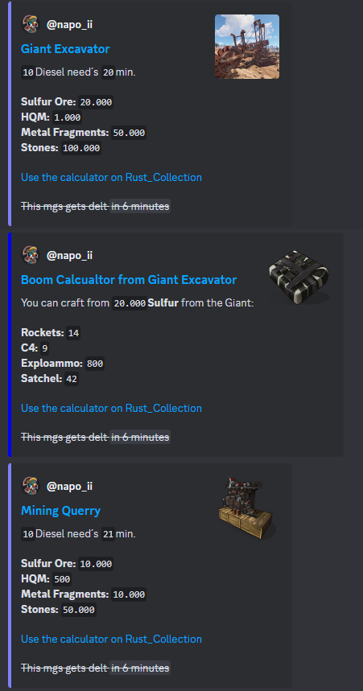

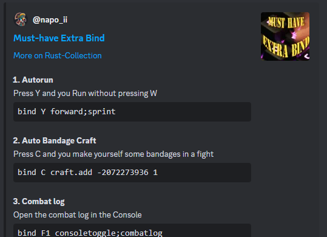

### Player Observation

The 🔔-player-observation channel features a player tracking tool, allowing you to monitor specific players on the server. Get insights into when players log in and log out. Additionally, utilize the notification tool to receive alerts when a tracked player comes online, if desired. Furthermore, you can view a list of all players on the server or even scan to identify potential team affiliations.

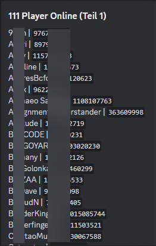
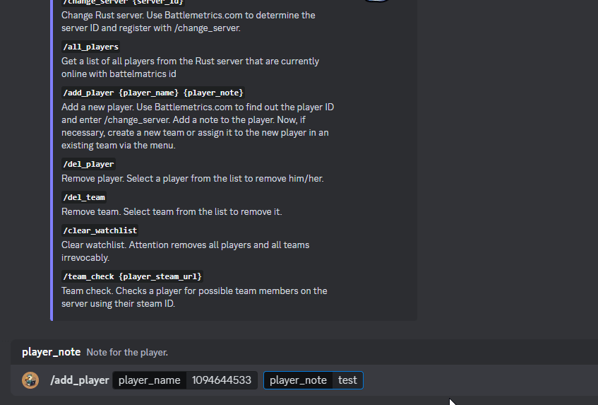
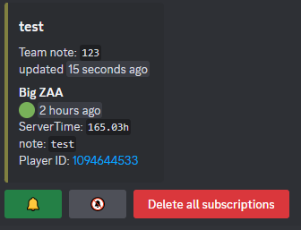
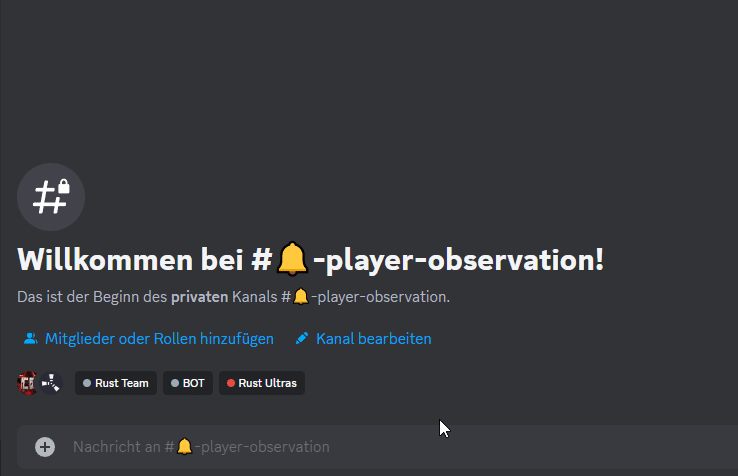

## 💻 Install <a name = "usage"></a>
1. [ ] Clone the Git
```cmd 
    git clone https://github.com/NapoII/Discord_Rust_Team_Bot
    pip install -r requirements.txt
```


2. [ ] Create a Discord bot on the Discord Dev website:
   https://discord.com/developers/applications?new_application=true


3. [ ] Enter the token and app id in the [token.ini](Discord_Rust_Team_bot/config/token.ini)
```ini
[discord]
discord_bot_name = 
token = 
application_id =
```
4. [ ] Add the Discord Bot to your Discord Server.
5. [ ] Add the Discord ID (Guild_ID) to the [config.ini](Discord_Rust_Team_bot/config/config.ini)
```ini
[client]
guild_name = 
guild_id = 
activity = Bubbly dubly wubly
praefix = !
```
6. [ ] You don't need to change the rest of the configuration, the bot will do that on its own. Only if you have some channels that you need to merge in to the bot.

## 💭 How it works <a name = "Use"></a>

start Discord_Rust_Team_Bot.py directly from the folder or run in cmd:
```cmd
cd <local path of Discord_Rust_Team_Bot>
python Discord_Rust_Team_Bot.py
```

When the bot is started for the first time, it will create the necessary channels and files. Afterward, it will prompt you to set permissions for the respective commands in your Discord Server's CMD channel. Once you've completed these steps, restart the bot, and you're ready to use it. Have fun!

## ☕ Buy me a coffee <a name = "coffee"></a>

Feel free to show your appreciation by treating me to a virtual coffee. Your support means a lot and keeps the creative coding vibes going! 🚀

<div style="text-align:center;">
    <a href="https://ko-fi.com/napo_ii"></a>
</div>

## 📚 LICENSE <a name = "LICENSE"></a>

[GNU GENERAL PUBLIC LICENSE Version 3](LICENSE)

[Discord_Rust_Team_Bot](https://github.com/NapoII/Discord_Rust_Team_Bot/tree/main) was created on 08.February.2024 by [NapoII](https://github.com/NapoII)


    
<p align="center">

</p>
